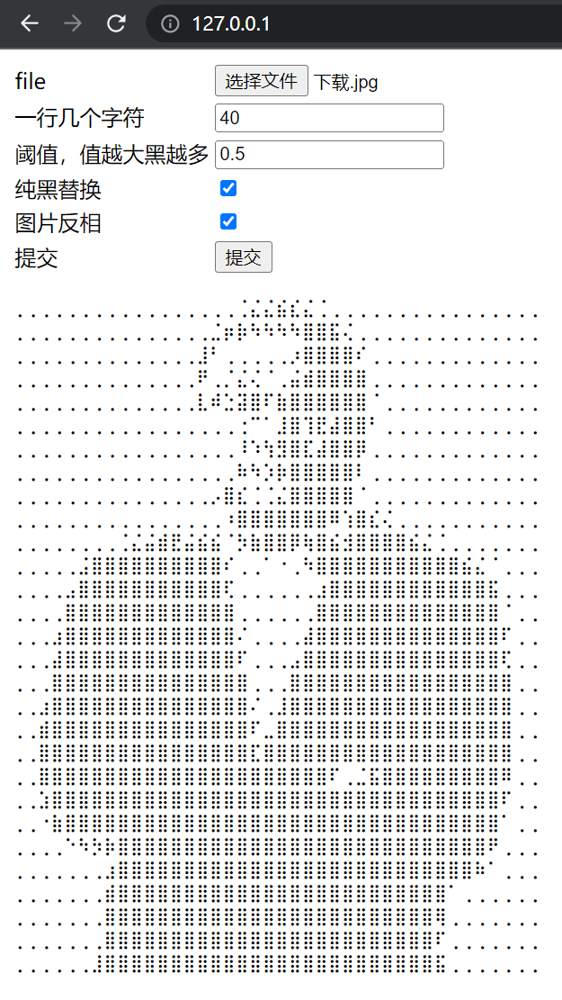
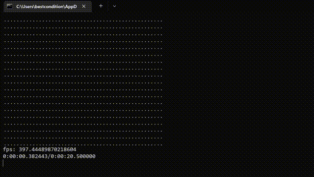

# Image (And Video) To Text

提示：这并不是一个OCR程序。

用下面255个unicode字符表示图片，同样提供可以播放`文本视频`

```text
⠁⠂⠃⠄⠅⠆⠇⠈⠉⠊⠋⠌⠍⠎⠏⠐⠑⠒⠓⠔⠕⠖⠗⠘⠙⠚⠛⠜⠝⠞⠟⠠⠡⠢⠣⠤⠥⠦⠧⠨⠩⠪⠫⠬⠭⠮⠯⠰⠱⠲⠳⠴⠵⠶⠷⠸⠹⠺⠻⠼⠽⠾⠿⡀⡁⡂⡃⡄⡅⡆⡇⡈⡉⡊⡋⡌⡍⡎⡏⡐⡑⡒⡓⡔⡕⡖⡗⡘⡙⡚⡛⡜⡝⡞⡟⡠⡡⡢⡣⡤⡥⡦⡧⡨⡩⡪⡫⡬⡭⡮⡯⡰⡱⡲⡳⡴⡵⡶⡷⡸⡹⡺⡻⡼⡽⡾⡿⢀⢁⢂⢃⢄⢅⢆⢇⢈⢉⢊⢋⢌⢍⢎⢏⢐⢑⢒⢓⢔⢕⢖⢗⢘⢙⢚⢛⢜⢝⢞⢟⢠⢡⢢⢣⢤⢥⢦⢧⢨⢩⢪⢫⢬⢭⢮⢯⢰⢱⢲⢳⢴⢵⢶⢷⢸⢹⢺⢻⢼⢽⢾⢿⣀⣁⣂⣃⣄⣅⣆⣇⣈⣉⣊⣋⣌⣍⣎⣏⣐⣑⣒⣓⣔⣕⣖⣗⣘⣙⣚⣛⣜⣝⣞⣟⣠⣡⣢⣣⣤⣥⣦⣧⣨⣩⣪⣫⣬⣭⣮⣯⣰⣱⣲⣳⣴⣵⣶⣷⣸⣹⣺⣻⣼⣽⣾⣿
```

## 安装依赖

```shell
# 安装依赖
pip install -r requirements.txt
```

只有windows平台需要安装windows-curses，如果是其他平台把这一行删掉

## 显示图片

```shell
python .\text_image.py .\image\sun.jpg --replace_blank
```

```text
⣿⣿⣿⣿⣿⣿⣿⣿⣿⣿⣿⣿⣿⣿⣿⣿⣿⣿⣿⣿⣿⣿⡷⠳⠳⠳⠳⠳⡷⣿⣿⣿⣿⣿⣿⣿⣿⣿⣿⣿⣿⣿⣿⣿⣿⣿⣿⣿⣿⣿
⣿⣿⣿⣿⣿⣿⣿⣿⣿⣿⣿⣿⣿⣿⣿⣿⣿⣿⣿⡿⠓⢀⢀⢀⢀⢀⢀⢀⢀⢀⠱⣷⣿⣿⣿⣿⣿⣿⣿⣿⣿⣿⣿⣿⣿⣿⣿⣿⣿⣿
⣿⣿⣿⣿⣿⣿⣿⣿⣿⣿⣿⣿⣿⣿⣿⣿⣿⣿⠗⣈⣮⣿⣿⣿⣿⣿⣿⠗⢀⢀⢀⢀⡱⣿⣿⣿⣿⣿⣿⣿⣿⣿⣿⣿⣿⣿⣿⣿⣿⣿
⣿⣿⣿⣿⣿⣿⣿⣿⣿⣿⣿⣿⣿⣿⣿⣿⣿⠿⢀⣿⣿⣿⣿⣿⣿⣿⣿⠎⢀⢀⢀⢀⢀⣳⣿⣿⣿⣿⣿⣿⣿⣿⣿⣿⣿⣿⣿⣿⣿⣿
⣿⣿⣿⣿⣿⣿⣿⣿⣿⣿⣿⣿⣿⣿⣿⣿⣿⠏⣾⣿⢷⢙⠳⡳⣿⡿⠳⠁⢀⢀⢀⢀⢀⣰⣿⣿⣿⣿⣿⣿⣿⣿⣿⣿⣿⣿⣿⣿⣿⣿
⣿⣿⣿⣿⣿⣿⣿⣿⣿⣿⣿⣿⣿⣿⣿⣿⣿⠏⠛⣉⡮⠢⢀⢀⡲⠆⢀⢀⢀⢀⢀⢀⢀⣰⣿⣿⣿⣿⣿⣿⣿⣿⣿⣿⣿⣿⣿⣿⣿⣿
⣿⣿⣿⣿⣿⣿⣿⣿⣿⣿⣿⣿⣿⣿⣿⣿⣿⣳⣯⣿⣯⣮⣌⣼⣼⠏⢀⣀⠈⢀⠗⢀⢀⢀⣿⣿⣿⣿⣿⣿⣿⣿⣿⣿⣿⣿⣿⣿⣿⣿
⣿⣿⣿⣿⣿⣿⣿⣿⣿⣿⣿⣿⣿⣿⣿⣿⣿⣿⣿⣿⣿⣟⢙⠺⠓⠁⢀⡐⣍⠄⢀⢀⢀⢀⣿⣿⣿⣿⣿⣿⣿⣿⣿⣿⣿⣿⣿⣿⣿⣿
⣿⣿⣿⣿⣿⣿⣿⣿⣿⣿⣿⣿⣿⣿⣿⣿⣿⣿⣿⣿⣿⠿⡷⡷⠳⠣⢀⢀⠁⢀⢀⢀⢀⣸⣿⣿⣿⣿⣿⣿⣿⣿⣿⣿⣿⣿⣿⣿⣿⣿
⣿⣿⣿⣿⣿⣿⣿⣿⣿⣿⣿⣿⣿⣿⣿⣿⣿⣿⣿⣿⡿⢇⣮⣮⢏⢈⠈⢀⢀⢀⢀⢀⢀⣿⣿⣿⣿⣿⣿⣿⣿⣿⣿⣿⣿⣿⣿⣿⣿⣿
⣿⣿⣿⣿⣿⣿⣿⣿⣿⣿⣿⣿⣿⣿⣿⣿⣿⣿⣿⠍⢀⠰⡷⡷⡷⠷⠁⢀⢀⢀⢀⢀⡰⣿⣿⣿⣿⣿⣿⣿⣿⣿⣿⣿⣿⣿⣿⣿⣿⣿
⣿⣿⣿⣿⣿⣿⣿⣿⣿⣿⣿⣿⣿⣿⣿⣿⣿⣿⣿⣿⢎⢀⢀⢀⢀⢀⢀⢀⢀⢀⢀⣈⢀⠱⡷⣿⣿⣿⣿⣿⣿⣿⣿⣿⣿⣿⣿⣿⣿⣿
⣿⣿⣿⣿⣿⣿⣿⣿⣿⣿⣿⣿⣿⡿⠷⢑⣽⡷⠷⡳⣿⠌⢀⢀⢀⢀⢀⢀⢀⢀⠶⡳⢀⢀⢀⢀⠑⡳⣷⣿⣿⣿⣿⣿⣿⣿⣿⣿⣿⣿
⣿⣿⣿⣿⣿⣿⣿⡷⠷⠳⠓⠁⢀⢀⢀⠐⢀⢀⢀⢀⣵⣿⣎⢈⢈⢈⢈⠬⠒⢀⢀⠐⢀⢀⢀⢀⢀⢀⢀⠐⠱⡳⡷⣿⣿⣿⣿⣿⣿⣿
⣿⣿⣿⣿⣿⣿⠗⢀⢀⢀⢀⢀⢀⢀⢀⢀⢀⢀⢀⢀⣰⣿⣿⣿⣿⣿⣿⣿⣎⢀⢀⢀⢀⢀⢀⢀⢀⢀⢀⢀⢀⢀⢀⢀⠱⡳⣿⣿⣿⣿
⣿⣿⣿⣿⣿⠟⢀⢀⢀⢀⢀⢀⢀⢀⢀⢀⢀⢀⢀⢀⢀⣿⣿⣿⣿⣿⣿⣿⣿⠏⢀⢀⢀⢀⢀⢀⢀⢀⢀⢀⢀⢀⢀⢀⢀⢀⣷⣿⣿⣿
⣿⣿⣿⣿⣿⠁⢀⢀⢀⢀⢀⢀⢀⢀⢀⢀⢀⢀⢀⢀⢀⣿⣿⣿⣿⣿⣿⣿⡿⢀⢀⢀⢀⢀⢀⢀⢀⢀⢀⢀⢀⢀⢀⢀⢀⢀⣰⣿⣿⣿
⣿⣿⣿⣿⠟⢀⢀⢀⢀⢀⢀⢀⢀⢀⢀⢀⢀⢀⢀⢀⢀⣰⣿⣿⣿⣿⣿⣿⠃⢀⢀⢀⢀⢀⢀⢀⢀⢀⢀⢀⢀⢀⢀⢀⢀⢀⠰⣿⣿⣿
⣿⣿⣿⣿⠇⢀⢀⢀⢀⢀⢀⢀⢀⢀⢀⢀⢀⢀⢀⢀⢀⡰⣿⣿⣿⣿⣿⠇⢀⢀⢀⢀⢀⢀⢀⢀⢀⢀⢀⢀⢀⢀⢀⢀⢀⢀⢀⣿⣿⣿
⣿⣿⣿⣿⢀⢀⢀⢀⢀⢀⢀⢀⢀⢀⢀⢀⢀⢀⢀⢀⢀⢀⣿⣿⣿⣿⠿⢀⢀⢀⢀⢀⢀⢀⢀⢀⢀⢀⢀⢀⢀⢀⢀⢀⢀⢀⢀⣿⣿⣿
⣿⣿⣿⠏⢀⢀⢀⢀⢀⢀⢀⢀⢀⢀⢀⢀⢀⢀⢀⢀⢀⢀⣰⣿⣿⣿⠁⢀⢀⢀⢀⢀⢀⢀⢀⢀⢀⢀⢀⢀⢀⢀⢀⢀⢀⢀⢀⣰⣿⣿
⣿⣿⣿⠁⢀⢀⢀⢀⢀⢀⢀⢀⢀⢀⢀⢀⢀⢀⢀⢀⢀⢀⢀⣿⣿⠟⢀⢀⢀⢀⢀⢀⢀⢀⢀⢀⢀⢀⢀⢀⢀⢀⢀⢀⢀⢀⢀⣰⣿⣿
⣿⣿⣿⢀⢀⢀⢀⢀⢀⢀⢀⢀⢀⢀⢀⢀⢀⢀⢀⢀⢀⢀⢀⣿⡿⢀⢀⢀⢀⢀⢀⢀⢀⢀⢀⢀⢀⢀⢀⢀⢀⢀⢀⢀⢀⢀⢀⣰⣿⣿
⣿⣿⠏⢀⢀⢀⢀⢀⢀⢀⢀⢀⢀⢀⢀⢀⢀⢀⢀⢀⢀⢀⢀⣿⠁⢀⢀⢀⢀⢀⢀⢀⢀⢀⢀⢀⢀⢀⢀⢀⢀⢀⢀⢀⢀⢀⢀⣰⣿⣿
⣿⣿⠏⢀⢀⢀⢀⢀⢀⢀⢀⢀⢀⢀⢀⢀⢀⢀⢀⢀⢀⢀⢀⠁⢀⢀⢀⢀⢀⢀⢀⢈⢈⢈⢈⢀⢀⢀⢀⢀⢀⢀⢀⢀⢀⢀⢀⣰⣿⣿
⣿⣿⠏⢀⢀⢀⢀⢀⢀⢀⢀⢀⢀⢀⢀⢀⢀⢀⢀⢀⢀⢀⢀⢀⢀⢀⢀⢀⢀⢀⡠⣿⠷⠓⠁⢀⢀⢀⢀⢀⢀⢀⢀⢀⢀⢀⢀⣿⣿⣿
⣿⣿⣯⢀⢀⢀⢀⢀⢀⢀⢀⢀⢀⢀⢀⢀⢀⢀⢀⢀⢀⢀⢀⢀⢀⢀⢀⢀⢀⢀⢀⢀⢀⢀⢀⢀⢀⢀⢀⢀⢀⢀⢀⢀⢀⢀⢀⣿⣿⣿
⣿⣿⣿⠎⢀⢀⢀⢀⢀⢀⢀⢀⢀⢀⢀⢀⢀⢀⢀⢀⢀⢀⢀⢀⢀⢀⢀⢀⢀⢀⢀⢀⢀⢀⢀⢀⢀⢀⢀⢀⢀⢀⢀⢀⢀⢀⣰⣿⣿⣿
⣿⣿⣿⣿⢌⢀⢀⢀⢀⢀⢀⢀⢀⢀⢀⢀⢀⢀⢀⢀⢀⢀⢀⢀⢀⢀⢀⢀⢀⢀⢀⢀⢀⢀⢀⢀⢀⢀⢀⢀⢀⢀⢀⢀⢀⢀⣼⣿⣿⣿
⣿⣿⣿⣿⣿⣿⣿⣮⣎⡌⢀⢀⢀⢀⢀⢀⢀⢀⢀⢀⢀⢀⢀⢀⢀⢀⢀⢀⢀⢀⢀⢀⢀⢀⢀⢀⢀⢀⢀⢀⢀⢀⢀⢀⢀⣀⣿⣿⣿⣿
⣿⣿⣿⣿⣿⣿⣿⣿⣿⠇⢀⢀⢀⢀⢀⢀⢀⢀⢀⢀⢀⢀⢀⢀⢀⢀⢀⢀⢀⢀⢀⢀⢀⢀⢀⢀⢀⢀⢀⢀⢀⢀⢀⢀⣈⣿⣿⣿⣿⣿
⣿⣿⣿⣿⣿⣿⣿⣿⣿⢀⢀⢀⢀⢀⢀⢀⢀⢀⢀⢀⢀⢀⢀⢀⢀⢀⢀⢀⢀⢀⢀⢀⢀⢀⢀⢀⢀⢀⢀⢀⢀⣮⣾⣿⣿⣿⣿⣿⣿⣿
⣿⣿⣿⣿⣿⣿⣿⣿⠿⢀⢀⢀⢀⢀⢀⢀⢀⢀⢀⢀⢀⢀⢀⢀⢀⢀⢀⢀⢀⢀⢀⢀⢀⢀⢀⢀⢀⢀⢀⢀⢀⣿⣿⣿⣿⣿⣿⣿⣿⣿
⣿⣿⣿⣿⣿⣿⣿⣿⠏⢀⢀⢀⢀⢀⢀⢀⢀⢀⢀⢀⢀⢀⢀⢀⢀⢀⢀⢀⢀⢀⢀⢀⢀⢀⢀⢀⢀⢀⢀⢀⢀⣿⣿⣿⣿⣿⣿⣿⣿⣿
⣿⣿⣿⣿⣿⣿⣿⣿⠇⢀⢀⢀⢀⢀⢀⢀⢀⢀⢀⢀⢀⢀⢀⢀⢀⢀⢀⢀⢀⢀⢀⢀⢀⢀⢀⢀⢀⢀⢀⢀⢀⣿⣿⣿⣿⣿⣿⣿⣿⣿
⣿⣿⣿⣿⣿⣿⣿⣿⢀⢀⢀⢀⢀⢀⢀⢀⢀⢀⢀⢀⢀⢀⢀⢀⢀⢀⢀⢀⢀⢀⢀⢀⢀⢀⢀⢀⢀⢀⢀⢀⢀⣿⣿⣿⣿⣿⣿⣿⣿⣿
```

```shell
python .\text_image.py .\image\sun.jpg -n 50 --threshold 127 --image_inverse --replace_blank
```

```text
⢀⢀⢀⢀⢀⢀⢀⢀⢀⢀⢀⢀⢀⢀⢀⢀⢀⢀⢀⢀⢀⢀⢈⣌⣌⣌⣌⣌⢈⢀⢀⢀⢀⢀⢀⢀⢀⢀⢀⢀⢀⢀⢀⢀⢀⢀⢀⢀⢀⢀
⢀⢀⢀⢀⢀⢀⢀⢀⢀⢀⢀⢀⢀⢀⢀⢀⢀⢀⢀⢀⣬⣿⣿⣿⣿⣿⣿⣿⣿⣿⣎⠈⢀⢀⢀⢀⢀⢀⢀⢀⢀⢀⢀⢀⢀⢀⢀⢀⢀⢀
⢀⢀⢀⢀⢀⢀⢀⢀⢀⢀⢀⢀⢀⢀⢀⢀⢀⢀⣨⠷⠑⢀⢀⢀⢀⢀⢀⣨⣿⣿⣿⣿⢎⢀⢀⢀⢀⢀⢀⢀⢀⢀⢀⢀⢀⢀⢀⢀⢀⢀
⢀⢀⢀⢀⢀⢀⢀⢀⢀⢀⢀⢀⢀⢀⢀⢀⢀⣀⡿⢀⢀⢀⢀⢀⢀⢀⢀⣱⣿⣿⣿⣿⣿⠌⢀⢀⢀⢀⢀⢀⢀⢀⢀⢀⢀⢀⢀⢀⢀⢀
⢀⢀⢀⢀⢀⢀⢀⢀⢀⢀⢀⢀⢀⢀⢀⢀⢀⣰⠁⢀⡈⡦⣌⢌⢀⢀⣌⣾⣿⣿⣿⣿⣿⠏⢀⢀⢀⢀⢀⢀⢀⢀⢀⢀⢀⢀⢀⢀⢀⢀
⢀⢀⢀⢀⢀⢀⢀⢀⢀⢀⢀⢀⢀⢀⢀⢀⢀⣰⣤⠶⢑⣝⣿⣿⢍⣹⣿⣿⣿⣿⣿⣿⣿⠏⢀⢀⢀⢀⢀⢀⢀⢀⢀⢀⢀⢀⢀⢀⢀⢀
⢀⢀⢀⢀⢀⢀⢀⢀⢀⢀⢀⢀⢀⢀⢀⢀⢀⠌⠐⢀⠐⠑⠳⠃⠃⣰⣿⠿⣷⡿⣨⣿⣿⣿⢀⢀⢀⢀⢀⢀⢀⢀⢀⢀⢀⢀⢀⢀⢀⢀
⢀⢀⢀⢀⢀⢀⢀⢀⢀⢀⢀⢀⢀⢀⢀⢀⢀⢀⢀⢀⢀⠠⡦⣅⣬⣾⣿⢯⠲⣻⣿⣿⣿⡿⢀⢀⢀⢀⢀⢀⢀⢀⢀⢀⢀⢀⢀⢀⢀⢀
⢀⢀⢀⢀⢀⢀⢀⢀⢀⢀⢀⢀⢀⢀⢀⢀⢀⢀⢀⢀⢀⣀⢈⢈⣌⣜⣿⣿⣾⣿⣿⣿⣿⠇⢀⢀⢀⢀⢀⢀⢀⢀⢀⢀⢀⢀⢀⢀⢀⢀
⢀⢀⢀⢀⢀⢀⢀⢀⢀⢀⢀⢀⢀⢀⢀⢀⢀⢀⢀⢀⢀⡸⠑⠑⡰⡷⣷⣿⣿⣿⣿⣿⣿⢀⢀⢀⢀⢀⢀⢀⢀⢀⢀⢀⢀⢀⢀⢀⢀⢀
⢀⢀⢀⢀⢀⢀⢀⢀⢀⢀⢀⢀⢀⢀⢀⢀⢀⢀⢀⣲⣿⣏⢈⢈⢈⣈⣾⣿⣿⣿⣿⣿⢏⢀⢀⢀⢀⢀⢀⢀⢀⢀⢀⢀⢀⢀⢀⢀⢀⢀
⢀⢀⢀⢀⢀⢀⢀⢀⢀⢀⢀⢀⢀⢀⢀⢀⢀⢀⢀⢀⡱⣿⣿⣿⣿⣿⣿⣿⣿⣿⣿⠷⣿⣎⢈⢀⢀⢀⢀⢀⢀⢀⢀⢀⢀⢀⢀⢀⢀⢀
⢀⢀⢀⢀⢀⢀⢀⢀⢀⢀⢀⢀⢀⢀⣈⡮⠂⢈⣈⢌⢀⣳⣿⣿⣿⣿⣿⣿⣿⡿⣉⢌⣿⣿⣿⣿⣮⢌⠈⢀⢀⢀⢀⢀⢀⢀⢀⢀⢀⢀
⢀⢀⢀⢀⢀⢀⢀⢈⣈⣌⣬⣾⣿⣿⣿⣯⣿⣿⣿⣿⠊⢀⠱⡷⡷⡷⡷⣓⣭⣿⣿⣯⣿⣿⣿⣿⣿⣿⣿⣯⣎⢌⢈⢀⢀⢀⢀⢀⢀⢀
⢀⢀⢀⢀⢀⢀⣨⣿⣿⣿⣿⣿⣿⣿⣿⣿⣿⣿⣿⣿⠏⢀⢀⢀⢀⢀⢀⢀⠱⣿⣿⣿⣿⣿⣿⣿⣿⣿⣿⣿⣿⣿⣿⣿⣎⢌⢀⢀⢀⢀
⢀⢀⢀⢀⢀⣠⣿⣿⣿⣿⣿⣿⣿⣿⣿⣿⣿⣿⣿⣿⣿⢀⢀⢀⢀⢀⢀⢀⢀⣰⣿⣿⣿⣿⣿⣿⣿⣿⣿⣿⣿⣿⣿⣿⣿⣿⠈⢀⢀⢀
⢀⢀⢀⢀⢀⣾⣿⣿⣿⣿⣿⣿⣿⣿⣿⣿⣿⣿⣿⣿⣿⢀⢀⢀⢀⢀⢀⢀⢀⣿⣿⣿⣿⣿⣿⣿⣿⣿⣿⣿⣿⣿⣿⣿⣿⣿⠏⢀⢀⢀
⢀⢀⢀⢀⣠⣿⣿⣿⣿⣿⣿⣿⣿⣿⣿⣿⣿⣿⣿⣿⣿⠏⢀⢀⢀⢀⢀⢀⣼⣿⣿⣿⣿⣿⣿⣿⣿⣿⣿⣿⣿⣿⣿⣿⣿⣿⣏⢀⢀⢀
⢀⢀⢀⢀⣸⣿⣿⣿⣿⣿⣿⣿⣿⣿⣿⣿⣿⣿⣿⣿⣿⢏⢀⢀⢀⢀⢀⣸⣿⣿⣿⣿⣿⣿⣿⣿⣿⣿⣿⣿⣿⣿⣿⣿⣿⣿⣿⢀⢀⢀
⢀⢀⢀⢀⣿⣿⣿⣿⣿⣿⣿⣿⣿⣿⣿⣿⣿⣿⣿⣿⣿⣿⢀⢀⢀⢀⣀⣿⣿⣿⣿⣿⣿⣿⣿⣿⣿⣿⣿⣿⣿⣿⣿⣿⣿⣿⣿⢀⢀⢀
⢀⢀⢀⣰⣿⣿⣿⣿⣿⣿⣿⣿⣿⣿⣿⣿⣿⣿⣿⣿⣿⣿⠏⢀⢀⢀⣾⣿⣿⣿⣿⣿⣿⣿⣿⣿⣿⣿⣿⣿⣿⣿⣿⣿⣿⣿⣿⠏⢀⢀
⢀⢀⢀⣾⣿⣿⣿⣿⣿⣿⣿⣿⣿⣿⣿⣿⣿⣿⣿⣿⣿⣿⣿⢀⢀⣠⣿⣿⣿⣿⣿⣿⣿⣿⣿⣿⣿⣿⣿⣿⣿⣿⣿⣿⣿⣿⣿⠏⢀⢀
⢀⢀⢀⣿⣿⣿⣿⣿⣿⣿⣿⣿⣿⣿⣿⣿⣿⣿⣿⣿⣿⣿⣿⢀⢀⣿⣿⣿⣿⣿⣿⣿⣿⣿⣿⣿⣿⣿⣿⣿⣿⣿⣿⣿⣿⣿⣿⠏⢀⢀
⢀⢀⣰⣿⣿⣿⣿⣿⣿⣿⣿⣿⣿⣿⣿⣿⣿⣿⣿⣿⣿⣿⣿⢀⣾⣿⣿⣿⣿⣿⣿⣿⣿⣿⣿⣿⣿⣿⣿⣿⣿⣿⣿⣿⣿⣿⣿⠏⢀⢀
⢀⢀⣰⣿⣿⣿⣿⣿⣿⣿⣿⣿⣿⣿⣿⣿⣿⣿⣿⣿⣿⣿⣿⣾⣿⣿⣿⣿⣿⣿⣿⡷⡷⡷⡷⣿⣿⣿⣿⣿⣿⣿⣿⣿⣿⣿⣿⠏⢀⢀
⢀⢀⣰⣿⣿⣿⣿⣿⣿⣿⣿⣿⣿⣿⣿⣿⣿⣿⣿⣿⣿⣿⣿⣿⣿⣿⣿⣿⣿⣿⢟⢀⣈⣬⣾⣿⣿⣿⣿⣿⣿⣿⣿⣿⣿⣿⣿⢀⢀⢀
⢀⢀⠐⣿⣿⣿⣿⣿⣿⣿⣿⣿⣿⣿⣿⣿⣿⣿⣿⣿⣿⣿⣿⣿⣿⣿⣿⣿⣿⣿⣿⣿⣿⣿⣿⣿⣿⣿⣿⣿⣿⣿⣿⣿⣿⣿⣿⢀⢀⢀
⢀⢀⢀⣱⣿⣿⣿⣿⣿⣿⣿⣿⣿⣿⣿⣿⣿⣿⣿⣿⣿⣿⣿⣿⣿⣿⣿⣿⣿⣿⣿⣿⣿⣿⣿⣿⣿⣿⣿⣿⣿⣿⣿⣿⣿⣿⠏⢀⢀⢀
⢀⢀⢀⢀⡳⣿⣿⣿⣿⣿⣿⣿⣿⣿⣿⣿⣿⣿⣿⣿⣿⣿⣿⣿⣿⣿⣿⣿⣿⣿⣿⣿⣿⣿⣿⣿⣿⣿⣿⣿⣿⣿⣿⣿⣿⣿⠃⢀⢀⢀
⢀⢀⢀⢀⢀⢀⢀⠑⠱⢳⣿⣿⣿⣿⣿⣿⣿⣿⣿⣿⣿⣿⣿⣿⣿⣿⣿⣿⣿⣿⣿⣿⣿⣿⣿⣿⣿⣿⣿⣿⣿⣿⣿⣿⣿⠿⢀⢀⢀⢀
⢀⢀⢀⢀⢀⢀⢀⢀⢀⣸⣿⣿⣿⣿⣿⣿⣿⣿⣿⣿⣿⣿⣿⣿⣿⣿⣿⣿⣿⣿⣿⣿⣿⣿⣿⣿⣿⣿⣿⣿⣿⣿⣿⣿⠷⢀⢀⢀⢀⢀
⢀⢀⢀⢀⢀⢀⢀⢀⢀⣿⣿⣿⣿⣿⣿⣿⣿⣿⣿⣿⣿⣿⣿⣿⣿⣿⣿⣿⣿⣿⣿⣿⣿⣿⣿⣿⣿⣿⣿⣿⣿⠑⠁⢀⢀⢀⢀⢀⢀⢀
⢀⢀⢀⢀⢀⢀⢀⢀⣀⣿⣿⣿⣿⣿⣿⣿⣿⣿⣿⣿⣿⣿⣿⣿⣿⣿⣿⣿⣿⣿⣿⣿⣿⣿⣿⣿⣿⣿⣿⣿⣿⢀⢀⢀⢀⢀⢀⢀⢀⢀
⢀⢀⢀⢀⢀⢀⢀⢀⣰⣿⣿⣿⣿⣿⣿⣿⣿⣿⣿⣿⣿⣿⣿⣿⣿⣿⣿⣿⣿⣿⣿⣿⣿⣿⣿⣿⣿⣿⣿⣿⣿⢀⢀⢀⢀⢀⢀⢀⢀⢀
⢀⢀⢀⢀⢀⢀⢀⢀⣸⣿⣿⣿⣿⣿⣿⣿⣿⣿⣿⣿⣿⣿⣿⣿⣿⣿⣿⣿⣿⣿⣿⣿⣿⣿⣿⣿⣿⣿⣿⣿⣿⢀⢀⢀⢀⢀⢀⢀⢀⢀
⢀⢀⢀⢀⢀⢀⢀⢀⣿⣿⣿⣿⣿⣿⣿⣿⣿⣿⣿⣿⣿⣿⣿⣿⣿⣿⣿⣿⣿⣿⣿⣿⣿⣿⣿⣿⣿⣿⣿⣿⣿⢀⢀⢀⢀⢀⢀⢀⢀⢀
```

查看参数描述

```shell
python .\text_image.py -h
```

```text
usage: 文本图片显示 [-h] [-n N] [--threshold THRESHOLD] [--image_inverse] [--replace_blank] file

positional arguments:
  file                  图片地址

optional arguments:
  -h, --help            show this help message and exit
  -n N                  每行字符数
  --threshold THRESHOLD
                        二值化阈值，0到255
  --image_inverse       图像反相，黑白颠倒
  --replace_blank       空白替换
```

至于要不要加反相，取决于你展示的平台，如果是白底黑字，则加上--image_inverse

如果有些平台对空白字符显示异常，建议加上--replace_blank

## 服务器

```shell
python .\server.py --host 127.0.0.1 -p 45883
```



## 播放视频

在一个支持utf-8的终端运行，例如windows平台可以用[windows terminal](https://github.com/microsoft/terminal)

```shell
python .\text_video.py .\video\bad_apple.mp4 -n 50 --info --replace_blank
```



运行之后会出现.tv后缀的渲染文件，可以直接指定渲染文件播放

查看所有参数

```shell
python .\text_video.py -h
```

基本是和文本的一致

```text
usage: text_video.py [-h] [-n N] [--threshold THRESHOLD] [--image_inverse] [--info] [--replace_blank] file

视频播放

positional arguments:
  file                  视频地址

optional arguments:
  -h, --help            show this help message and exit
  -n N                  每行字符数
  --threshold THRESHOLD
                        二值化阈值，0到255
  --image_inverse       图像反相，黑白颠倒
  --info                显示详细信息
  --replace_blank       空白替换
```

## 更新日志

### 2022年5月4日22点06分

- resize和二值化分开做，且用opencv的api，快了不少！
- 计算长宽的函数都没了，没必要弄这么多函数
- 改删了点参数，每行字符数改n，纯黑替换参数删除了，阈值改成0到255整数
- 服务器默认绑定127.0.0.1，端口45883

### 2022年5月5日

- 封装成类，TextImage, TextVideo
- 文本视频播放器
- 多进程渲染video

### 2022年5月6日

- 保存文件改为二进制，体积变为原来的1/3
- 视频播放进度条等信息
- 添加命令行参数

### 2022年5月8日

- 增加空白字符替换功能，默认是不替换的