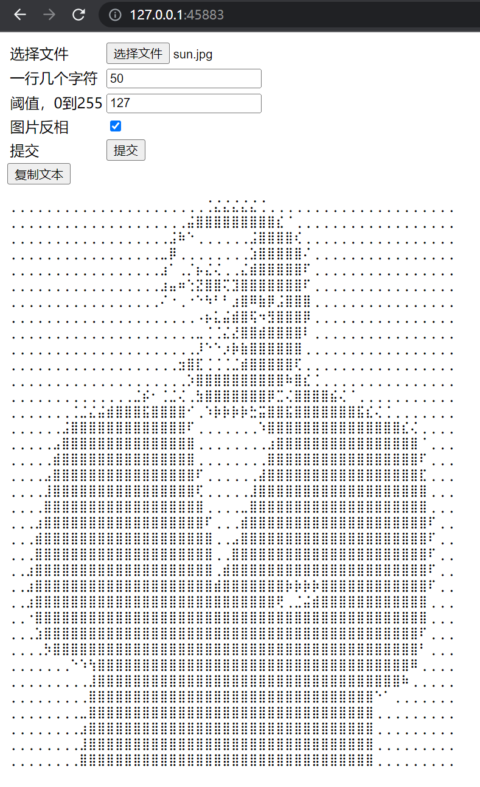

# 图片转文本

## 参数说明

- n: 每行字符数
- threshold: 二值化阈值
- image_inverse: 黑白转换

## 转换示例
```shell
# 安装依赖
pip install -r requirements.txt
```
```shell
# 运行
python text_image.py
```


```text
⣿⣿⣿⣿⣿⣿⣿⣿⣿⣿⣿⣿⣿⣿⣿⣿⣿⣿⣿⣿⣿⣿⡷⠳⠳⠳⠳⠳⡷⣿⣿⣿⣿⣿⣿⣿⣿⣿⣿⣿⣿⣿⣿⣿⣿⣿⣿⣿⣿⣿
⣿⣿⣿⣿⣿⣿⣿⣿⣿⣿⣿⣿⣿⣿⣿⣿⣿⣿⣿⡿⠓⢀⢀⢀⢀⢀⢀⢀⢀⢀⠱⣷⣿⣿⣿⣿⣿⣿⣿⣿⣿⣿⣿⣿⣿⣿⣿⣿⣿⣿
⣿⣿⣿⣿⣿⣿⣿⣿⣿⣿⣿⣿⣿⣿⣿⣿⣿⣿⠗⣈⣮⣿⣿⣿⣿⣿⣿⠗⢀⢀⢀⢀⡱⣿⣿⣿⣿⣿⣿⣿⣿⣿⣿⣿⣿⣿⣿⣿⣿⣿
⣿⣿⣿⣿⣿⣿⣿⣿⣿⣿⣿⣿⣿⣿⣿⣿⣿⠿⢀⣿⣿⣿⣿⣿⣿⣿⣿⠎⢀⢀⢀⢀⢀⣳⣿⣿⣿⣿⣿⣿⣿⣿⣿⣿⣿⣿⣿⣿⣿⣿
⣿⣿⣿⣿⣿⣿⣿⣿⣿⣿⣿⣿⣿⣿⣿⣿⣿⠏⣾⣿⢷⢙⠳⡳⣿⡿⠳⠁⢀⢀⢀⢀⢀⣰⣿⣿⣿⣿⣿⣿⣿⣿⣿⣿⣿⣿⣿⣿⣿⣿
⣿⣿⣿⣿⣿⣿⣿⣿⣿⣿⣿⣿⣿⣿⣿⣿⣿⠏⠛⣉⡮⠢⢀⢀⡲⠆⢀⢀⢀⢀⢀⢀⢀⣰⣿⣿⣿⣿⣿⣿⣿⣿⣿⣿⣿⣿⣿⣿⣿⣿
⣿⣿⣿⣿⣿⣿⣿⣿⣿⣿⣿⣿⣿⣿⣿⣿⣿⣳⣯⣿⣯⣮⣌⣼⣼⠏⢀⣀⠈⢀⠗⢀⢀⢀⣿⣿⣿⣿⣿⣿⣿⣿⣿⣿⣿⣿⣿⣿⣿⣿
⣿⣿⣿⣿⣿⣿⣿⣿⣿⣿⣿⣿⣿⣿⣿⣿⣿⣿⣿⣿⣿⣟⢙⠺⠓⠁⢀⡐⣍⠄⢀⢀⢀⢀⣿⣿⣿⣿⣿⣿⣿⣿⣿⣿⣿⣿⣿⣿⣿⣿
⣿⣿⣿⣿⣿⣿⣿⣿⣿⣿⣿⣿⣿⣿⣿⣿⣿⣿⣿⣿⣿⠿⡷⡷⠳⠣⢀⢀⠁⢀⢀⢀⢀⣸⣿⣿⣿⣿⣿⣿⣿⣿⣿⣿⣿⣿⣿⣿⣿⣿
⣿⣿⣿⣿⣿⣿⣿⣿⣿⣿⣿⣿⣿⣿⣿⣿⣿⣿⣿⣿⡿⢇⣮⣮⢏⢈⠈⢀⢀⢀⢀⢀⢀⣿⣿⣿⣿⣿⣿⣿⣿⣿⣿⣿⣿⣿⣿⣿⣿⣿
⣿⣿⣿⣿⣿⣿⣿⣿⣿⣿⣿⣿⣿⣿⣿⣿⣿⣿⣿⠍⢀⠰⡷⡷⡷⠷⠁⢀⢀⢀⢀⢀⡰⣿⣿⣿⣿⣿⣿⣿⣿⣿⣿⣿⣿⣿⣿⣿⣿⣿
⣿⣿⣿⣿⣿⣿⣿⣿⣿⣿⣿⣿⣿⣿⣿⣿⣿⣿⣿⣿⢎⢀⢀⢀⢀⢀⢀⢀⢀⢀⢀⣈⢀⠱⡷⣿⣿⣿⣿⣿⣿⣿⣿⣿⣿⣿⣿⣿⣿⣿
⣿⣿⣿⣿⣿⣿⣿⣿⣿⣿⣿⣿⣿⡿⠷⢑⣽⡷⠷⡳⣿⠌⢀⢀⢀⢀⢀⢀⢀⢀⠶⡳⢀⢀⢀⢀⠑⡳⣷⣿⣿⣿⣿⣿⣿⣿⣿⣿⣿⣿
⣿⣿⣿⣿⣿⣿⣿⡷⠷⠳⠓⠁⢀⢀⢀⠐⢀⢀⢀⢀⣵⣿⣎⢈⢈⢈⢈⠬⠒⢀⢀⠐⢀⢀⢀⢀⢀⢀⢀⠐⠱⡳⡷⣿⣿⣿⣿⣿⣿⣿
⣿⣿⣿⣿⣿⣿⠗⢀⢀⢀⢀⢀⢀⢀⢀⢀⢀⢀⢀⢀⣰⣿⣿⣿⣿⣿⣿⣿⣎⢀⢀⢀⢀⢀⢀⢀⢀⢀⢀⢀⢀⢀⢀⢀⠱⡳⣿⣿⣿⣿
⣿⣿⣿⣿⣿⠟⢀⢀⢀⢀⢀⢀⢀⢀⢀⢀⢀⢀⢀⢀⢀⣿⣿⣿⣿⣿⣿⣿⣿⠏⢀⢀⢀⢀⢀⢀⢀⢀⢀⢀⢀⢀⢀⢀⢀⢀⣷⣿⣿⣿
⣿⣿⣿⣿⣿⠁⢀⢀⢀⢀⢀⢀⢀⢀⢀⢀⢀⢀⢀⢀⢀⣿⣿⣿⣿⣿⣿⣿⡿⢀⢀⢀⢀⢀⢀⢀⢀⢀⢀⢀⢀⢀⢀⢀⢀⢀⣰⣿⣿⣿
⣿⣿⣿⣿⠟⢀⢀⢀⢀⢀⢀⢀⢀⢀⢀⢀⢀⢀⢀⢀⢀⣰⣿⣿⣿⣿⣿⣿⠃⢀⢀⢀⢀⢀⢀⢀⢀⢀⢀⢀⢀⢀⢀⢀⢀⢀⠰⣿⣿⣿
⣿⣿⣿⣿⠇⢀⢀⢀⢀⢀⢀⢀⢀⢀⢀⢀⢀⢀⢀⢀⢀⡰⣿⣿⣿⣿⣿⠇⢀⢀⢀⢀⢀⢀⢀⢀⢀⢀⢀⢀⢀⢀⢀⢀⢀⢀⢀⣿⣿⣿
⣿⣿⣿⣿⢀⢀⢀⢀⢀⢀⢀⢀⢀⢀⢀⢀⢀⢀⢀⢀⢀⢀⣿⣿⣿⣿⠿⢀⢀⢀⢀⢀⢀⢀⢀⢀⢀⢀⢀⢀⢀⢀⢀⢀⢀⢀⢀⣿⣿⣿
⣿⣿⣿⠏⢀⢀⢀⢀⢀⢀⢀⢀⢀⢀⢀⢀⢀⢀⢀⢀⢀⢀⣰⣿⣿⣿⠁⢀⢀⢀⢀⢀⢀⢀⢀⢀⢀⢀⢀⢀⢀⢀⢀⢀⢀⢀⢀⣰⣿⣿
⣿⣿⣿⠁⢀⢀⢀⢀⢀⢀⢀⢀⢀⢀⢀⢀⢀⢀⢀⢀⢀⢀⢀⣿⣿⠟⢀⢀⢀⢀⢀⢀⢀⢀⢀⢀⢀⢀⢀⢀⢀⢀⢀⢀⢀⢀⢀⣰⣿⣿
⣿⣿⣿⢀⢀⢀⢀⢀⢀⢀⢀⢀⢀⢀⢀⢀⢀⢀⢀⢀⢀⢀⢀⣿⡿⢀⢀⢀⢀⢀⢀⢀⢀⢀⢀⢀⢀⢀⢀⢀⢀⢀⢀⢀⢀⢀⢀⣰⣿⣿
⣿⣿⠏⢀⢀⢀⢀⢀⢀⢀⢀⢀⢀⢀⢀⢀⢀⢀⢀⢀⢀⢀⢀⣿⠁⢀⢀⢀⢀⢀⢀⢀⢀⢀⢀⢀⢀⢀⢀⢀⢀⢀⢀⢀⢀⢀⢀⣰⣿⣿
⣿⣿⠏⢀⢀⢀⢀⢀⢀⢀⢀⢀⢀⢀⢀⢀⢀⢀⢀⢀⢀⢀⢀⠁⢀⢀⢀⢀⢀⢀⢀⢈⢈⢈⢈⢀⢀⢀⢀⢀⢀⢀⢀⢀⢀⢀⢀⣰⣿⣿
⣿⣿⠏⢀⢀⢀⢀⢀⢀⢀⢀⢀⢀⢀⢀⢀⢀⢀⢀⢀⢀⢀⢀⢀⢀⢀⢀⢀⢀⢀⡠⣿⠷⠓⠁⢀⢀⢀⢀⢀⢀⢀⢀⢀⢀⢀⢀⣿⣿⣿
⣿⣿⣯⢀⢀⢀⢀⢀⢀⢀⢀⢀⢀⢀⢀⢀⢀⢀⢀⢀⢀⢀⢀⢀⢀⢀⢀⢀⢀⢀⢀⢀⢀⢀⢀⢀⢀⢀⢀⢀⢀⢀⢀⢀⢀⢀⢀⣿⣿⣿
⣿⣿⣿⠎⢀⢀⢀⢀⢀⢀⢀⢀⢀⢀⢀⢀⢀⢀⢀⢀⢀⢀⢀⢀⢀⢀⢀⢀⢀⢀⢀⢀⢀⢀⢀⢀⢀⢀⢀⢀⢀⢀⢀⢀⢀⢀⣰⣿⣿⣿
⣿⣿⣿⣿⢌⢀⢀⢀⢀⢀⢀⢀⢀⢀⢀⢀⢀⢀⢀⢀⢀⢀⢀⢀⢀⢀⢀⢀⢀⢀⢀⢀⢀⢀⢀⢀⢀⢀⢀⢀⢀⢀⢀⢀⢀⢀⣼⣿⣿⣿
⣿⣿⣿⣿⣿⣿⣿⣮⣎⡌⢀⢀⢀⢀⢀⢀⢀⢀⢀⢀⢀⢀⢀⢀⢀⢀⢀⢀⢀⢀⢀⢀⢀⢀⢀⢀⢀⢀⢀⢀⢀⢀⢀⢀⢀⣀⣿⣿⣿⣿
⣿⣿⣿⣿⣿⣿⣿⣿⣿⠇⢀⢀⢀⢀⢀⢀⢀⢀⢀⢀⢀⢀⢀⢀⢀⢀⢀⢀⢀⢀⢀⢀⢀⢀⢀⢀⢀⢀⢀⢀⢀⢀⢀⢀⣈⣿⣿⣿⣿⣿
⣿⣿⣿⣿⣿⣿⣿⣿⣿⢀⢀⢀⢀⢀⢀⢀⢀⢀⢀⢀⢀⢀⢀⢀⢀⢀⢀⢀⢀⢀⢀⢀⢀⢀⢀⢀⢀⢀⢀⢀⢀⣮⣾⣿⣿⣿⣿⣿⣿⣿
⣿⣿⣿⣿⣿⣿⣿⣿⠿⢀⢀⢀⢀⢀⢀⢀⢀⢀⢀⢀⢀⢀⢀⢀⢀⢀⢀⢀⢀⢀⢀⢀⢀⢀⢀⢀⢀⢀⢀⢀⢀⣿⣿⣿⣿⣿⣿⣿⣿⣿
⣿⣿⣿⣿⣿⣿⣿⣿⠏⢀⢀⢀⢀⢀⢀⢀⢀⢀⢀⢀⢀⢀⢀⢀⢀⢀⢀⢀⢀⢀⢀⢀⢀⢀⢀⢀⢀⢀⢀⢀⢀⣿⣿⣿⣿⣿⣿⣿⣿⣿
⣿⣿⣿⣿⣿⣿⣿⣿⠇⢀⢀⢀⢀⢀⢀⢀⢀⢀⢀⢀⢀⢀⢀⢀⢀⢀⢀⢀⢀⢀⢀⢀⢀⢀⢀⢀⢀⢀⢀⢀⢀⣿⣿⣿⣿⣿⣿⣿⣿⣿
⣿⣿⣿⣿⣿⣿⣿⣿⢀⢀⢀⢀⢀⢀⢀⢀⢀⢀⢀⢀⢀⢀⢀⢀⢀⢀⢀⢀⢀⢀⢀⢀⢀⢀⢀⢀⢀⢀⢀⢀⢀⣿⣿⣿⣿⣿⣿⣿⣿⣿
```

## 服务器

```shell
python server.py
```




## 视频播放功能

```shell
# 最好在自带的终端运行
python text_video.py ./video/bad_apple.mp4 --width 200

# 更多用法，请查看帮助
python text_video.py -h
```

## 更新日志

### 2022年5月4日22点06分

- resize和二值化分开做，且用opencv的api，快了不少！
- 计算长宽的函数都没了，没必要弄这么多函数
- 改删了点参数，每行字符数改n，纯黑替换参数删除了，阈值改成0到255整数
- 服务器默认绑定127.0.0.1，端口45883

### 2022年5月5日

- 封装成类，TextImage, TextVideo
- 文本视频播放器
- 多进程渲染video